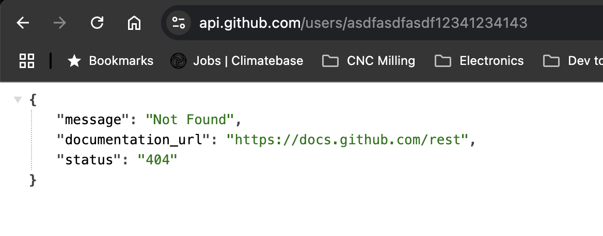
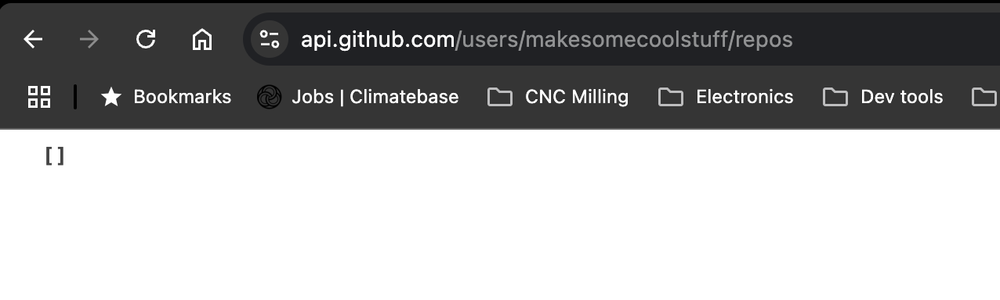

# Coding Exercise for Chris Schmitz

## Overview

Here's my submission for the Branch Coding Exercises. I spent probably 3 or 4 hours on it. There are aspects of the codebase that I would or may change given more time or if it was a real project, but I think this should give an idea of my normal approach. 

## Up and running

> [!IMPORTANT]
> This project uses Java 21 

To get up and running with this project:
```shell
# Checkout the codebase:
git clone git@github.com:chris-schmitz/branch-github-exercise.git
cd branch-github-exercise

# Build the code and run the tests:
./gradlew build

# Launch the jar
java -jar build/libs/BranchCodingExercise-0.0.1-SNAPSHOT.jar

# Open a browser and navigate to:
http://localhost:8080/rest/github/octocat
```

### Github Actions

It wasn't called for in the PDF, but just to call it out I did setup github actions in this repository to confirm the build and tests outside of my local machine. Not necessary, but after so many years of working in dynamic languages I don't feel completely comfortable without a third party "yes this worked on more than just your machine" confirmation 😅. 

## Callouts about the code

There are a couple of things I wanted to call out in the code ahead of time. I figure some if not all of this would be stuff that we'd discuss in the review meeting, but I figured I'd note them here just in case I forget to call them out during the meeting. 

### Missing feign client testing

One of the things I realized while writing this code is that while I use feign clients all the time at work, I haven't really used them to make calls outside of our company's ecosystem. Most of my calling-out-to-external-api history has been in other languages and frameworks. So while I am used to writing tests for my feign client methods, the tests then to verify that they're calling specific endpoints within our system (i.e. we make feign clients in a codebase so that other codebases can pull that module and make calls into the original codebase), but I haven't really written tests to verify calls going out. 

Conceptually it seems like I'd need to do something to fake out the external API I was calling out to, and looking around online I see tools for doing that, but I didn't want to use this exercise as the first time I sat down to learn the tools. So for now I skipped tests for the feign client and just verified that the feign client calls themselves were being called. That said I did stand up the API and confirm that the live calls do indeed work. So yeah, not full full code coverage, but given a real project and timeline yes I would take the time to learn how to implement those tools.  

### Caching

#### Why the separate caching test suite

The test setup for the caching is not what I would typically do. Normally I would test the caching in the service test or maybe the integration test depending on what was being mocked, but I didn't think about how I was setting up the other tests when I went to write the caching code. 

I couldn't test the caching in my web test because I was already mocking out the service where the caching is happening, and I probably _could_ test it with the existing service test, but with the way I needed to set up a spy and autowire the service it felt like it would make the service test a bit less clear to read (at least if it ended up being a larger service), though it's arguable if that's an issue or not.

Regardless, 11pm me decided that rather than trying to make it "perfect" I would make it approachable by separating the caching test out on its own. Current me is second guessing it, but I'm not going to touch it. Really, this is the kind of thing that I would likely pull another engineer in to get a second opinion on because I want my tests to be _clear_, _readable_, and _easily understood_. 

#### Cache settings
As far as the cache settings I know there was a note about rate-limiting which made the cache called for, so I added in the default caching, but I didn't customize it further. 

My reasoning behind this is that we have _some_ of the context on the caching need but not _all_ of the context. We don't really know how the user plans on using this integration, how often they're likely going to be calling out to github with this, we don't have any monitoring on the API's activity to see how often it's actually calling github, so it's hard to say if and what customizations we'd want on the caching (I actually started creating a cache manager config class but deleted it because I would want more info first). We could definitely make some educated guesses on the cache timing based on githubs docs, but without the _full_ full picture it would just be a guess whereas if we talk to the customer we may have a better idea of how we want to cache or even if it's going to get enough traffic that we may as well go further and setup the auth token go get hire rate limits. 

This is _not_ me being lazy ;P, just me wanting to keep things as simple and approachable as possible and only adding complexity as it's called for. 

### Exception handling for user vs repos

An interesting little detail that I noticed while I was reading the github documentation for the user details call vs the user repos list call was that while the call to the `api.github.com/user` endpoint will return a 404 when given an invalid username:



When you call the `api.github.com/user/{username}/repos` endpoint for a user with no repos you still get a success with an empty list returned:



It's not explicitly called out in the documentation, but when I was making the custom exceptions I thought "hmmm, _would_ an exception be thrown if I didn't have any repos? It doesn't seem like an exception-worthy concept". So to test it out I signed up for github with my burner gmail account and called the api with it (which is the call in the above screenshot).

This is why in my code [I only have one try/catch with only one custom exception](https://github.com/chris-schmitz/branch-github-exercise/blob/faa34149e0841dbff0daa0f8a95c1c260a019870/src/main/java/biz/schmitz/BranchCodingExercise/github/service/GithubService.java#L26-L35) for the feign client calls. And since [I'm tying our API calls to github's API version explicitly in the GithubFeignClient interface](https://github.com/chris-schmitz/branch-github-exercise/blob/3c505f78fbca7636edbac1c020a82640a3da13b9/src/main/java/biz/schmitz/BranchCodingExercise/github/api/GithubFeignClient.java#L11) we know that we're safe to not cleanly catching a custom exception for "a valid user with no repositories" as long as we're still using this version of the github api. _MAYBE_ that's overkill, but I thought it was a cool little detail that had an effect on the code structure that was worth mentioning :)

### TDD flow -> leaving service test in

I know my service test and my integration tests pretty much do the same thing. The is a byproduct of the way I like to approach TDD. For most API work I will:

- Start with the web test layer to establish the endpoint contract and assert that the API endpiont is working
  - I like starting with this because it means that I and the front end engineer can agree on our touch points at the beginning of a feature and both go to our work knowing that our code is good to go as far as relaying information
- As part of the web test I'm forced to create and mock out service calls which naturally leads into the service unit tests
- As I build out the service unit tests I normally end up creating the tooling that I can repurpose for an integration tests (e.g. the mock setups, data payloads, etc)
  - Most of the time the service tests naturally leads to the repository tests, but we didn't need that layer in this case
- Then I can confirm all of the parts work by building out the integration test and it goes quickly because I can pull most of the setup from other tests I created along the way

I've had conversations with other engineers where they've said that because the service and integration tests are so similar you could argue that the service tests are superfluous and make the codebase a bit brittle because now you have two locations that need to be updated for the same logic. I get that and in some cases I could (and have) just deleted the service tests afterwards and left the integration tests only. In this case, the concepts are so simple and the API is so slim that it's probably one of those delete-the-service-test cases. That said, I wanted to leave it in for this exercise to show the progression (and not require you digging through my commit history to see it).

The cases where I would definitely leave both would be when the service tests are a more involved and there are lots of branches to cover. I like the integration tests to test the main happy and bad paths, but I tend to leave the really granular testing for service and domain layer tests. But yeah, that's an opinion that I'm still kind of shaping out in my head. It's been heavily influenced by working with some of the engineers at my current job and it's cool to have those kind of structure opinion conversations to help me figure out what I actually like. 

### Method documentation
I've gone back and forth on method documentation over the course of my career. At my current job when I started people were _very_ anti method documentation and that's become somewhat less strict over the years. At previous jobs I've had people require method documentations in some cases to a bad extreme. 

Where I currently land is:
- Your code should be clear enough to explain itself so method documentation aren't completely necessary
- That said, public entry points are really nice to have human readable documentation. It tends to be where people are looking first when diving through the code, so giving a leg up is nice
- If you're going to add method documentation, it should only go on public methods.
  - It feels like most of the time if your private methods need a method document it's a sign that they're either too big or not clearly written

Ultimately, my opinion on that (and most things) is definitely open to influence and I'm cool going with whatever the team decides on. 

# Tasks for assignment

- [x] Stand up a server
- [x] Have an endpoint that takes a username
- [x] Fetch or retrieve the data
- [x] Return the JSON defined above
- [x] Have tests to prove your implementation
- [x] Add caching
